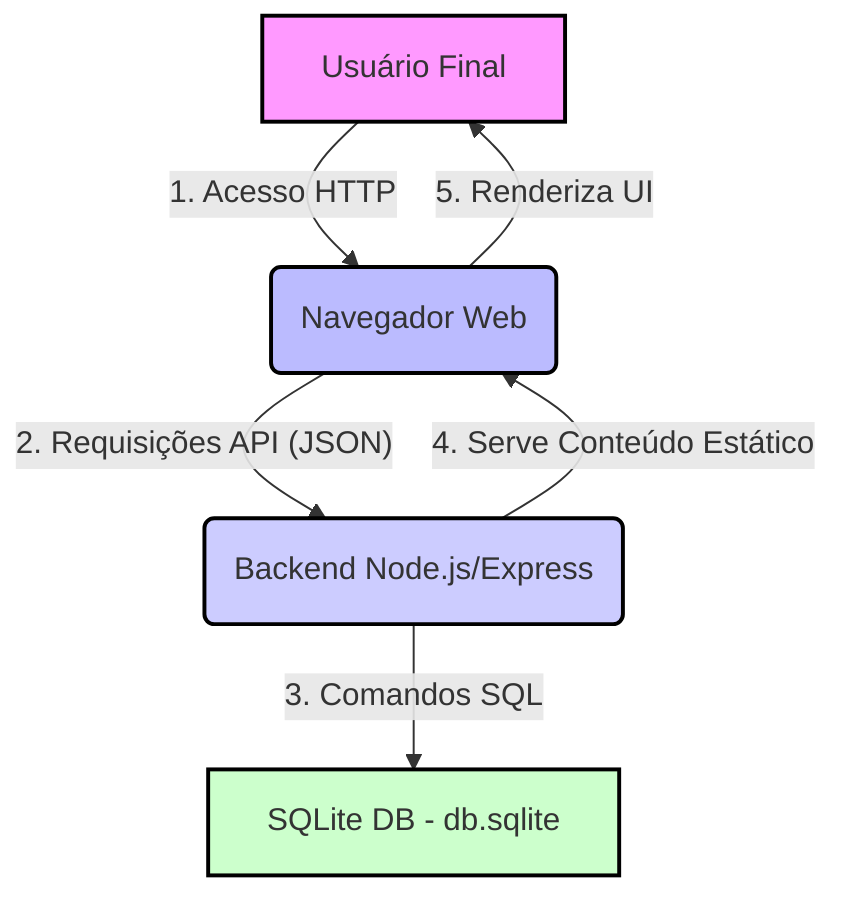

## 3. Arquitetura Técnica do Taskry

Este documento define a arquitetura de alto nível, a stack tecnológica e a estrutura de diretórios do projeto.

# 3. Arquitetura Técnica do Taskry

Este documento define a arquitetura de alto nível, a stack tecnológica e a estrutura de diretórios do projeto.

## 3.1. Diagrama de Alto Nível (Modelo C4 - Nível 1)

O diagrama abaixo ilustra a relação entre as principais entidades do sistema.



## 3.2. Stack Tecnológica

| Camada | Tecnologia | Detalhes / Justificativa |
| :--- | :--- | :--- |
| **Backend (Server)** | Node.js (LTS) | Runtime JavaScript para alto desempenho e ecossistema robusto. |
| **Backend (Framework)** | Express | Framework minimalista e flexível para criação da API REST. |
| **Banco de Dados** | SQLite3 | Banco de dados leve baseado em arquivo (`better-sqlite3`), ideal para MVPs. |
| **Frontend** | HTML5 / Vanilla JS / CSS | Simplicidade e rapidez na implementação da UI para o MVP. |
| **DevOps / Ambiente** | Git / WSL2 | Versionamento profissional e ambiente Linux padronizado. |

---

## 3.3. Estrutura de Diretórios

```bash
taskry/
├── .gitignore
├── README.md
└── docs/
    ├── 01-visao-geral.md
    ├── 02-requisitos.md
    ├── 03-arquitetura.md  # (Este arquivo)
    └── 04-api-rest.md
└── backend/
    ├── package.json
    ├── index.js
    ├── db.sqlite
    └── public/
        ├── index.html
        ├── style.css
        └── main.js

